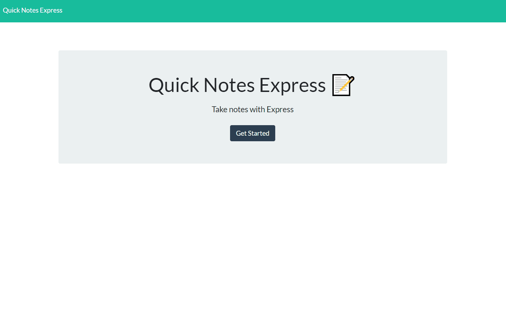

# Quick Notes Express 
[](https://www.mit.edu/~amini/LICENSE.md)
<br>
Created an application that can be used to write, save, and delete notes. This application will use an express backend and save and retrieve note data from a JSON file. For users that need to keep track of a lot of information, it's easy to forget or be unable to recall something important. Being able to take persistent notes allows users to have written information available when needed.
  
<br>



<br>

## Built With
* JavaScript
* HTML
* CSS
* Express
* Node.js

## Installation
Run in terminal:
``` npm install ```


## Code Example
First the required variables were grabbed along with creating our server and middleware handlers:
```
var express = require("express");
var path = require("path");
var fs = require("fs");
var jsondb = require("./db/db.json");

var app = express();
var PORT = process.env.PORT || 3000;

app.use(express.urlencoded({ extended: true }));
app.use(express.json());
app.use(express.static("public"));
```

Each 
```
function promptUser(){
    return inquirer.prompt([
        {
            type: "input",
            name: "author",
            message: "What is the author's name?"
        },
        {
            type: "input",
            name: "username",
            message: "What is your GitHub username?"
        },
        {
            type: "input",
            name: "email",
            message: "What is your email address?"


            etc...
```
Responses are placed in README template.
```
return`# ${response.title}  ${badge}

${response.description}

## Table of Contents:
* [Installation](#installation)
* [Usage](#usage)
* [License](#license)
* [Contributing](#contributing)
* [Tests](#tests)
* [Questions](#questions)

### Installation:
In order to install the necessary dependencies, open the console and run the following:

\`\`\`${response.installations}\`\`\`

### Usage:
${response.usage}

### License:
This project is licensed under:

${response.license}

etc...
```

Template is written to "generatedREADME.md".
```
promptUser().then(function(response){
    const markdown = generateMD(response);
    return writeFileAsync("./generated/generatedREADME.md", markdown);
}).then(function () {
        console.log("Generating README.md ...");
    }).catch(function(err){
    console.log(err)
})

```


### Installation:
The README Generator repository already contains the dependencies you will need inside the "package.json" file.
In order to install the necessary dependencies, just open the console and run the following:

```npm install```

### Usage:
The generator will overwrite anything in the generatedREADME markdown file. Make sure to move any changes you may want to keep. For this reason it is generated in the folder "generated" to protect against accidentally overwriting user's current readme.

### License:
This project is licensed under:

MIT

### Questions:
If you have any questions contact me on [GitHub](https://github.com/joshglugatch) or contact 
Josh Glugatch at joshglugatch@gmail.com


<br>

[](https://github.com/joshglugatch)
<br>
[](www.linkedin.com/in/joshua-glugatch)